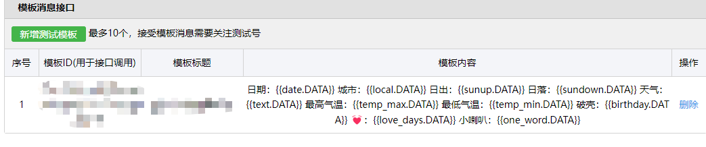

1.首先你需要申请一个微信公众号测试号 链接：https://mp.weixin.qq.com/debug/cgi-bin/sandbox?t=sandbox/login

2.注册账号后页面显示 appID，appsecret, 测试号二维码，模板消息接口

3.让接收推送消息的微信扫描测试号二维码并关注后，右侧显示微信昵称和微信号

4.新增测试模板，模板标题即为推送消息第一行显示的文字，模板内容可根据自己需要来自定义，自动生成模板ID

5.打开和风天气开发平台 链接：https://dev.qweather.com/docs/api/

6.注册账号后登录，在左侧应用管理里面创建应用，选择免费开发版-->Web Api 后，页面显示KEY

7.在此链接里面查询当地对应的的 location_ID 编号 链接：https://github.com/qwd/LocationList/blob/master/China-City-List-latest.csv

## (注意)为便于区分全国各地（县区和市区名称存在混淆的情况），和风天气采用唯一的Location_ID来查询天气

8.打开PersonInfo.txt文件，替换其中的app_id(appID)，app_secret(appsecret)，template_id(模板ID),user(公众平台显示的微信号)，weather_key(KEY),location(Location_ID)，生日,恋爱日

## (注意)Wechat.py中109-111行是推送中的位置信息，由于PersonInfo.txt文件中输入的为local_code(Location_id)不是城市信息，故需要更改相应的城市信息，one_word采用的是<每日一句情话>链接：https://blog.mcloc.cn/archives/604.html
